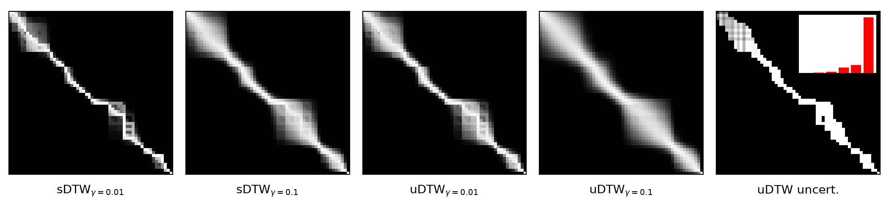
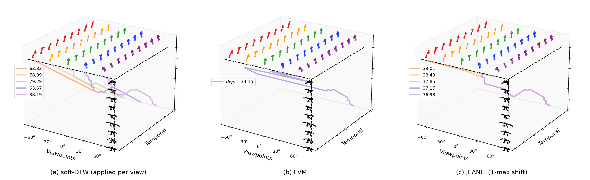

# torchwarp

Faster PyTorch version of uncertainty-DTW (uDTW) and JEANIE.

## Installation

### For pip user

```bash
git clone https://github.com/hibana2077/torchwarp && cd torchwarp
pip install -r requirements.txt -e .
```

### For uv user

```bash
git clone https://github.com/hibana2077/torchwarp && cd torchwarp
uv sync --extra cu126
# or --extra cu128 / --extra cpu;
```

## Usage

### Using uDTW

`uDTW` compares two batches of sequences, given a per-frame
uncertainty (sigma) for each, e.g. from a small SigmaNet. It returns
the distance and the uncertainty penalty, one value per pair.

```python
import torch
import torch.nn as nn
import torchwarp

# sequences: [batch, length, features]
X = torch.randn(16, 30, 8, device="cuda", requires_grad=True)
Y = torch.randn(16, 40, 8, device="cuda")

# per-frame sigma: [batch, length, 1], must be positive
sigma_net = nn.Sequential(
    nn.Linear(8, 32),
    nn.ReLU(),
    nn.Linear(32, 1),
    nn.Softplus(),
).cuda()
sx = sigma_net(X) + 1e-3
sy = sigma_net(Y) + 1e-3

udtw = torchwarp.uDTW(gamma=1.0, normalize=True)
d, omega = udtw(X, Y, sx, sy, beta=1.0)
loss = (d + omega).mean()
loss.backward()
```

For a custom distance or penalty, build the pairwise matrices
yourself and pass them to `udtw_from_matrices`:

```python
# default matrices, each [batch, len_x, len_y]
cost, penalty, variance = torchwarp.pairwise_matrices(
    X, Y, sx, sy, beta=1.0)
d, omega = torchwarp.udtw_from_matrices(cost, penalty, gamma=1.0)

# e.g. a cosine distance instead of the default one
cos = 1 - torch.nn.functional.cosine_similarity(
    X.unsqueeze(2), Y.unsqueeze(1), dim=-1)
d, omega = torchwarp.udtw_from_matrices(
    cos / variance, penalty, gamma=1.0)
```

### Using JEANIE

`JEANIE` aligns a query, seen from several simulated viewpoints,
with a support sequence over both time and viewpoint. `max_shift`
limits how far the viewpoint can move between neighbouring steps.

```python
# query: [batch, views, length, features]
query = torch.randn(8, 5, 10, 64, device="cuda", requires_grad=True)
# support: [batch, length, features]
support = torch.randn(8, 12, 64, device="cuda")

jeanie = torchwarp.JEANIE(gamma=0.1, max_shift=1)
dist = jeanie(query, support)
dist.sum().backward()

# also return the (differentiable) alignment table
dist, R = jeanie(query, support, return_accumulator=True)

# two viewpoint axes: [batch, views_1, views_2, length, features]
query_2d = torch.randn(8, 3, 3, 10, 64, device="cuda")
jeanie_2d = torchwarp.JEANIE(gamma=0.1, max_shift=(1, 1))
dist_2d = jeanie_2d(query_2d, support)
```

### Visualization

`torchwarp.plot` draws warping paths in the style of the uDTW and
JEANIE papers. It needs matplotlib: `pip install -e ".[vis]"` (or
`uv sync --extra cu126 --extra vis`).

```python
from torchwarp import plot

# uDTW paths and uncertainty (uDTW paper, Fig. 2)
fig = plot.udtw_figure(X, Y, sx, sy, gammas=(0.01, 0.1))
fig.savefig("udtw_paths.png")

# soft-DTW / FVM / JEANIE paths (JEANIE paper, Fig. 7)
angles = [-60, -30, 0, 30, 60]  # one per query view
fig = plot.viewpoint_figure(query, support, angles)
fig.savefig("viewpoint_paths.png")
```

To draw skeletons as below, also pass `query_poses`, `support_poses`
and `bones`. The paths themselves are available without matplotlib:

```python
a = torchwarp.paths.jeanie(query, support, gamma=0.1)
a.soft  # path probabilities: [batch, views, len_q, len_s]
a.path  # hard path per pair: [(t, u, view), ...]
```

ECG5000, forecast vs. ground truth of a trained uDTW model:



NW-UCLA, query vs. support of the same action (donning):



## Results

Mean ± std over seeds 42, 43, 44. Hyperparameters are the defaults in [`examples/`](examples/); run `bash examples/download_data.sh` and then `python examples/ecg5000_forecast.py --loss <loss>` or `python examples/nwucla_fewshot.py --method <method>`.

### Speed

Mean time per training step (ms), official implementation vs torchwarp on the same task and settings.

| method (task) | official CPU | torchwarp CPU | speed-up | official GPU | torchwarp GPU | speed-up |
| --- | --- | --- | --- | --- | --- | --- |
| uDTW (ECG5000) | 957.6 | 84.6 | 11× | 1809.7 | 1.35 | 1345× |
| uDTW (NW-UCLA) | 37.5 | 22.0 | 1.7× | 92.2 | 6.18 | 15× |
| FVM (NW-UCLA) | 157.6 | 5.75 | 27× | 363.9 | 2.93 | 124× |
| JEANIE (NW-UCLA) | 961.8 | 10.03 | 96× | 2362.3 | 2.17 | 1091× |

### Time series – ECG5000

UCR ECG5000: forecast the last 40% of each series from the first 60%. Rows: training loss; columns: test metric (lower is better).

| training loss | MSE | DTW | sDTW div. | uDTW |
| --- | --- | --- | --- | --- |
| Euclidean | 0.2161 ± 0.0065 | 5.5127 ± 0.3189 | 7.8376 ± 0.3005 | 2.5342 ± 0.0911 |
| DTW | 0.7299 ± 0.1767 | 5.3317 ± 0.4190 | 19.0465 ± 3.5771 | 9.3703 ± 2.7353 |
| sDTW div. | 0.7248 ± 0.1845 | 5.3684 ± 0.5537 | 19.0471 ± 3.7483 | 9.2619 ± 2.7557 |
| uDTW | 0.2698 ± 0.0138 | 6.8878 ± 0.4812 | 8.4908 ± 0.4687 | 2.7986 ± 0.1459 |

### Few-shot – NW-UCLA

Cross-view 5-way 1-shot action recognition on NW-UCLA (train classes 1–5, test classes 6, 8, 9, 11, 12; queries from the unseen view 3).

| method | accuracy (%) |
| --- | --- |
| sDTW | 24.41 ± 2.47 |
| sDTW div. | 24.60 ± 3.56 |
| uDTW | 24.06 ± 8.43 |
| FVM | 41.15 ± 0.43 |
| JEANIE | 37.08 ± 2.37 |

## Citation

If you find this project useful for your research, please cite the following original papers.

### uDTW

```bibtex
@inproceedings{wang2022uncertainty,
  title={Uncertainty-dtw for time series and sequences},
  author={Wang, Lei and Koniusz, Piotr},
  booktitle={European Conference on Computer Vision},
  pages={176--195},
  year={2022},
  organization={Springer}
}
```

### JEANIE

```bibtex
@article{wang2024meet,
  title={Meet jeanie: a similarity measure for 3d skeleton sequences via temporal-viewpoint alignment},
  author={Wang, Lei and Liu, Jun and Zheng, Liang and Gedeon, Tom and Koniusz, Piotr},
  journal={International Journal of Computer Vision},
  volume={132},
  number={9},
  pages={4091--4122},
  year={2024},
  publisher={Springer}
}
```